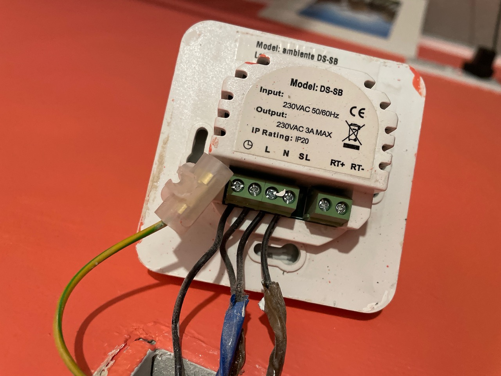
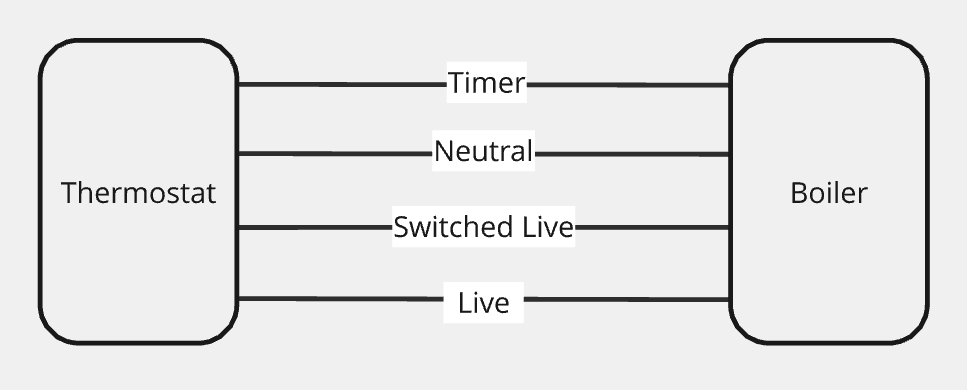
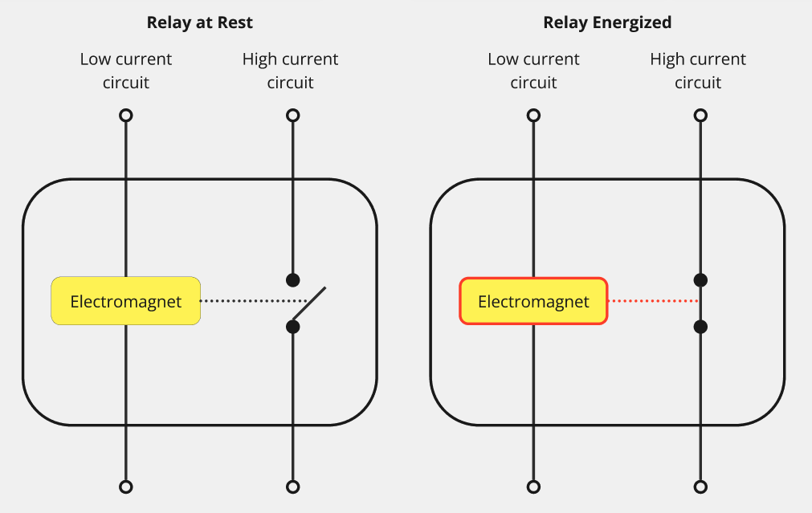
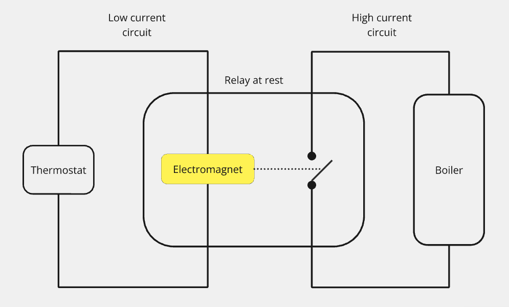
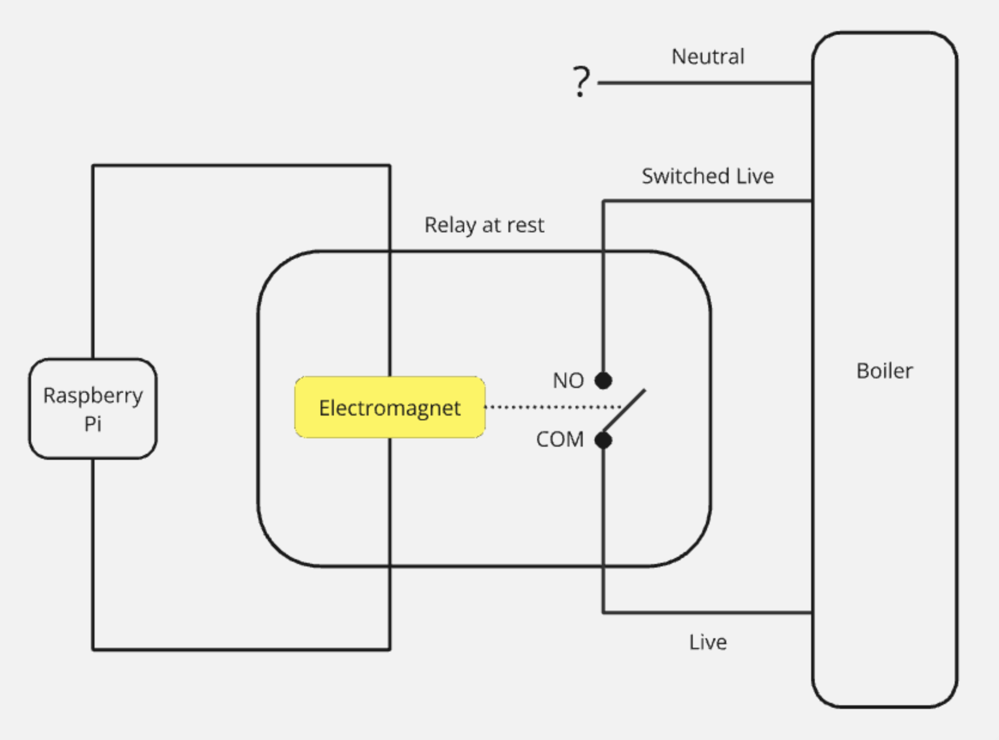
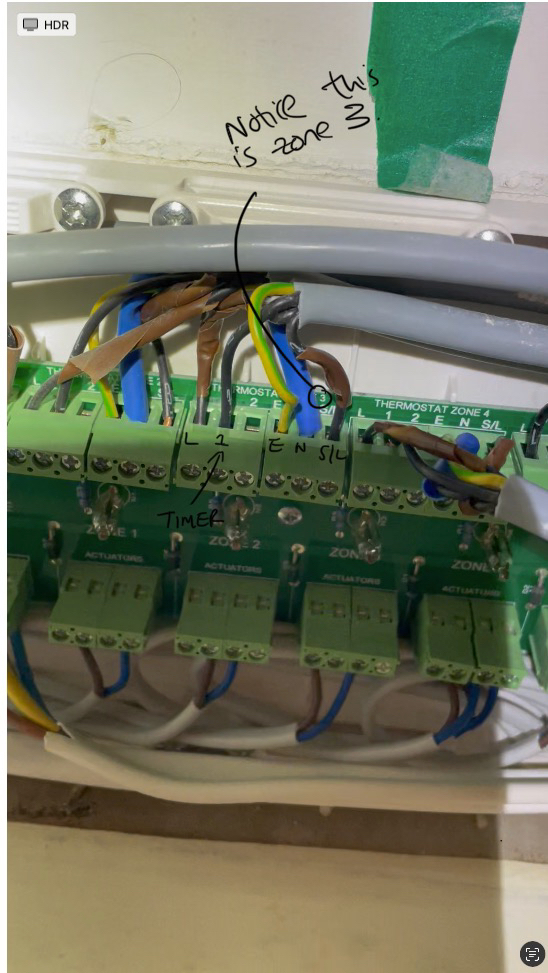

### Introduction
Thermostats are a piece of technology that every home has and they’re getting smarter all the time. In the race to decarbonisation, reducing our energy consumption by being efficient with how we heat our homes is crucial. To better understand my own heating system, I recently replaced my traditional thermostat with a custom-built smart version.

In this blog series, I’ll share my journey, detailing the problems I encountered and how I solved them. While a basic understanding of programming and electrical concepts will be beneficial, I’ve made sure to explain everything in a way that's accessible to beginners as well.

This first post dives into how I managed to control the boiler using a Raspberry Pi.

### The first piece of the puzzle: controlling the boiler

How does turning our thermostat up or down control our boiler?


I took my existing thermostat off the wall to look at the cabling. It had four cables attached: one labelled “L”, one labelled “N”, one labelled “SL” and one that looked like a clock for timing functions. From my basic electrical knowledge I knew that L stood for Live (or Line in some regions), N stood for Neutral and SL stood for Switched Live (or some times Switched Line).





Seeing Switched Live gave me a hint that there’s some kind of switch within the thermostat that turns something on or off on demand. That could only mean one thing: a relay.

### What is a relay?

A relay is an electrically operated switch that allows you to control a high-power circuit (like that of the heating system) with a low-power circuit (like one powered by a Raspberry Pi). Why can’t you just directly control the high-power circuit? One big reason is safety: it prevents the user having to directly interact with high-power devices and provides a physical barrier. Another reason is that microcontrollers (like a Raspberry Pi or the microcontroller inside a thermostat) operate at low voltages and cannot directly handle the high voltages of household appliances or industrial equipment.

A relay consists of an electromagnet and a switch: when electric current from the low-power device passes through the coil of the electromagnet, it creates a magnetic field that closes the switch and powers on the high-power circuit. This also works the other way around: when the current from the low-power device stops, the magnetic field dissipates and the switch opens, cutting off the power to the high-power circuit.


To help visualise things, here’s a diagram of the relay connecting the thermostat to the boiler:


So the first thing to do was replace the thermostat in the above diagram with a Raspberry Pi connected to a relay.

### Selecting a relay

I chose a [Waveshare 3 terminal relay](https://thepihut.com/products/raspberry-pi-relay-board) because it has three relays so I can eventually control three heating zones. It was also a Raspberry Pi HAT (Hardware Attached on Top) which meant I could plug it directly into the Raspberry Pi’s header pins.

When I first opened the relay I was confused because I was only expecting two terminals for each relay: one for Live and one for Switched Live as I thought that was all that was required to create a complete circuit. Instead, what I was looking at were terminals labelled NO, NC and COM, which I came to learn meant Normally Open, Normally Closed and Common respectively.

Normally Open and Normally Closed are the two options relays have for controlling a circuit and these represent the default state of the system that the relay will control, so we only need to choose one of these terminals depending on our setup. 

Normally Closed means that when the relay is not energised, the switch is *closed* and there is power running through the circuit. An example of a Normally Closed system is an emergency stop button: the system is usually running but when the emergency stop is triggered, you want the relay to become energised and open the switch to cut the power. 

Normally Open is the opposite: when the relay is not energised, the switch is *open* and there is no power running through the circuit. An example of a Normally Open system is a thermostat: the system is usually off, but when the temperature drops below a certain threshold you want the relay to become energised and close the switch to power the heating system.

The final terminal is Common. This is called common because it’s the shared connection point on the relay as it connects to the Normally Open and Normally Closed terminals and will provide the power to whichever configuration you need. 

So that’s the relay configuration settled: we need to use COM and NO. The beauty of HATs is that they simply plug into the Raspberry Pi with minimal setup.

Let’s return to the thermostat hanging off the wall and see if we can work out what cables go where.

**Replacing the thermostat with a Raspberry Pi and relay**

Before I started messing about with power cables, I switched off the power for the heating system at my consumer unit and used a [voltage detector pen](https://www.screwfix.com/p/fluke-ac-non-contact-voltage-detector-pen-1000v-ac/85949) to confirm it was definitely off.

If we look at our problem again, we have four cables coming out the wall (Live, Neutral, Switched Live and timer) but only two terminals going into our relay.
We’re not interested in the timer functionality for now, so that can be ignored. We need power for the heating circuit, so connecting Live to Common seems promising, as Common provides power to to the relay’s other chosen terminal. That leaves us with Neutral and Switched Live to consider. Switched Live is crucial because it allows us to control when power is delivered to the heating system via the relay so let’s go with Switched Live in the Normally Open terminal.

Replacing our thermostat with a relay would look something like this:



### Tying up the loose ends

We now have a Neutral cable hanging out of the wall, going nowhere. Why don’t we need this additional cable for our circuit? Our existing thermostat was powered on even when the relay wasn’t activated (that is, for the LEDs and the controller that measures the temperature) so it required a constantly closed electrical circuit to control that: power coming through Live and returning through Neutral. The Switched Live was an additional return that was only powered to turn on the heating system. Our system doesn’t require the always powered circuit to control the thermostat, since we’re using a Raspberry Pi to control the system and that’s powered via a mains power supply.

Before switching the power back on, I needed to disconnect the Neutral and timer cables so they were inactive cables and there was no chance of power coming from the heating unit. Luckily, I had a clearly labelled HIU (Heating Interface Unit).




Because I knew what zone my room was, I knew which cables I was looking for in the HIU. I unhooked the Neutral and timer cables from here and used some Wago clips on each end of the cable to ensure no copper was left exposed.

Now I flicked the power back on and used the voltage detector to verify that the Neutral and timer didn’t miraculously have any power running through them.

### Setting up the relay

The next question was how to actually control the relay from the Raspberry Pi. To get started I made a simple circuit with an LED, so I could write the code without breaking the boiler.

Relays have two options for energizing them: active low or active high. Active high means the relay is activated when a high voltage (usually the same as the supply voltage of the controller) is sent to the relay’s control pin. Active low means the relay is activated when a low voltage (usually 0 volts) is sent to the relay’s control pin. All this information can be found from the [wiki](https://www.waveshare.com/wiki/RPi_Relay_Board) (the Pi Hut has fantastic info listed with their products).

The relay is controlled via the GPIO (General Purpose Input Output) pins on the Raspberry Pi, which we can interface with via the `RPi.GPIO` Python library. Since our relay is active low, we just need to set `GPIO.LOW` to energise the relay and `GPIO.HIGH` to turn it off. Remember our controller has three relays, which each has its own channel number that we’ll use to communicate with it. Since we’re only using one relay for the moment we only need one of the channels.

I decided to wrap the relay functionality in a Python class to abstract away the specifics of the relay. Once you’ve set the relay up you don’t really care about the pins or active low or high, you just want to turn it on or off.

```python
import RPi.GPIO as GPIO

class Relay:
    """
    A class to represent a relay controlled by Raspberry Pi. This is designed to work with an ACTIVE LOW relay (i.e. LOW turns the relay on).
    """
    def __init__(self, pin):
        self.pin = pin
        GPIO.setmode(GPIO.BCM) # Refer to pins by their Broadcom SOC channel number (associated to Broadcom chipset on the Pi).
        GPIO.setup(self.pin, GPIO.OUT, initial=GPIO.HIGH) # Initially OFF for ACTIVE LOW.
    
    @property
    def is_active(self):
        return GPIO.input(self.pin) == GPIO.LOW
    
    def turn_on(self):
        GPIO.output(self.pin, GPIO.LOW)
        print("Relay ON")

    def turn_off(self):
        GPIO.output(self.pin, GPIO.HIGH)
        print("Relay OFF")

    def cleanup(self):
        GPIO.cleanup(self.pin)
        print("GPIO Cleaned up")
```

Now we can test this out with the following:

```python
if __name__ == "__main__":
    pin_number = 17  # Example GPIO pin number, change this to your actual relay GPIO pin
    relay = Relay(pin_number)

    try:
        print("Testing Relay ON:")
        relay.turn_on()
        time.sleep(1)  # Short pause to observe the change
        if relay.is_active:
            print("Test Passed: Relay is active.")
        else:
            print("Test Failed: Relay is not active when it should be.")

        print("Testing Relay OFF:")
        relay.turn_off()
        time.sleep(1)  # Short pause to observe the change
        if not relay.is_active:
            print("Test Passed: Relay is inactive.")
        else:
            print("Test Failed: Relay is still active when it should be inactive.")

    finally:
        # Clean up at the end of the tests
        relay.cleanup()
```

Fortunately my HIU had a light for each zone so I could verify that the relay did power on the boiler.


### Conclusion

That’s the first piece of the puzzle solved. However, we now have a Raspberry Pi and cables hanging out the wall and our smart thermostat isn’t even a thermostat yet since you need to manually turn it on or off using our Python code, which didn't go down well in my house. 


In the next part we’ll look into how we can measure the temperature of the room and use that to regulate the temperature using the relay.

Got any comments or corrections? This was a learning process for me so I’d love to hear any feedback.